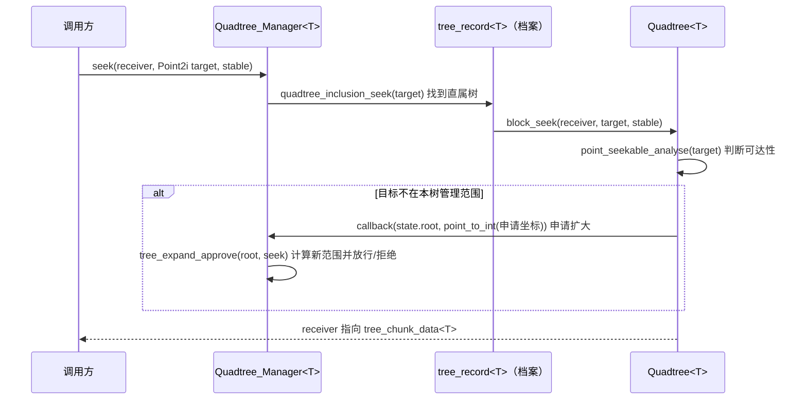

# 项目导航：引擎层空间分区（坐标类型替换 + 四叉树 / 四叉树管理器）

> 版次：`引擎层 9758826`（`main` → `engine`）+ `测试层 561a915`（`test` → `test`）
> 前序版次：引擎层 `00a7c31`、测试层 `7f0d4e7`
> 本文件的正文主体是**引擎层空间分区**这一块，其中「三、坐标类型」是本版次变更的主线。

---

## 一、一句话定位

引擎层空间分区用的坐标从三个手写结构体（`coord2D_int` / `coord2D_double` / `coord2D_range`）换成了 `坐标类型.h` 里的模板类型（`Point2i` / `Point2d` / `Rect2i`）；新类型**取消了跨精度隐式转换**，所以任何「浮点坐标要塞进接收整数坐标的接口」的地方，都必须显式调用 `point_to_int`。本版次就是把这个换成全仓一致、并让编译与用例都恢复全绿。

一句话记法：**类型名字全换了，算法一行没动；跨精度的两处必须显式转换。**

---

## 二、项目与层级结构

### 2.1 四层关系

```
白银纪元/（顶层仓库，只统辖目录，不跟踪下层内容）
├── 测试层/   独立仓库（分支 test  → 远端 sliverera/test）
├── 系统层/   独立仓库（分支 main  → 远端 sliverera/system）
├── 引擎层/   独立仓库（分支 main  → 远端 sliverera/engine）   ← 本版次主战场
└── 游戏层/   独立仓库（分支 main  → 远端 sliverera/game）
```

- 四层各自是**独立 git 仓库**，顶层仓库不跟踪它们的内容；因此「引擎层有提交」时顶层仓库不会有新提交。
- 远端统一为 `https://github.com/yuxingyuzhong/SilverEra.git`。
- ⚠️ 引擎层本地分支名叫 `main`，上游分支名叫 `engine`，**名字不一致**。`git push` 会被 `push.default=simple` 直接拦下（fatal），必须写成显式 refspec：`git push sliverera HEAD:engine`。

### 2.2 层间链接方式（本层视角）

- 引擎层**不依赖**任何上层；它只被上层（测试层等）通过「源码 include + 链接静态库」的方式消费。
- 空间分区对外只暴露两个模板类：`engine::Quadtree<T>`、`engine::Quadtree_Manager<T>`。
- 空间分区自身的依赖只有两个（都在本层内）：
  - `引擎层/src/core/spatial/common/core/坐标类型.h`（坐标类型，本版次主线）
  - `引擎层/src/tools/Auxi_Algorithm/二分查找.h`（管理器里按根节点 X 坐标做序列查找）
- 与本模块**平级、但零耦合**的邻居：`spatial/collision/`（碰撞模块）。本版次清点确认碰撞模块对旧坐标类型**零引用**，无需联动。

### 2.3 本层产物与目标

- 目标：`EngineCore` 静态库（`引擎层/out/build/x64-Debug/lib/EngineCore.lib`）。
- 生成器/编译器：Ninja + MSVC（本机 `14.51.36231`），配置 `x64-Debug`。
- `引擎层/CMakeLists.txt` 用 `GLOB_RECURSE` 收集 `src/` 下的源文件，所以**新增/改名头文件不需要改 CMake**，改完直接构建即可。
- 头文件与实现分离方式：头文件分「数据结构 / 函数预声明 / 实现 hpp」，实现 hpp 由 `四叉树.h`、`四叉树管理器.h` 汇总包含；两个 `实例化.cpp` 只负责把 `T = int` 的具名实例化编译出来。

### 2.4 目录布局（本次涉及的子树）

```
引擎层/src/core/spatial/
├── common/core/
│   ├── 坐标类型.h                    ← 本版次主线：旧三结构体 → Point2<T>/Rect2<T>
│   └── 依赖库封装.h
├── partition/
│   ├── Quadtree/                     ← 四叉树本体
│   │   ├── 四叉树.h                  （汇总入口）
│   │   ├── 函数预声明.h              （类定义 + 接口声明）
│   │   ├── 数据结构.h                （tree_state / tree_chunk_data）
│   │   └── core/
│   │       ├── 设置与交互.hpp
│   │       ├── 导航与范围计算.hpp
│   │       ├── 节点创建与树扩大.hpp   （无旧类型引用，本版次未动）
│   │       ├── 区块信息检索.hpp       ← 含 1 处 point_to_int
│   │       └── 四叉树实例化.cpp       （无旧类型引用，本版次未动）
│   └── Quadtree_Manager/             ← 多树编排（管理器）
│       ├── 四叉树管理器.h            （汇总入口）
│       ├── 函数预声明.h
│       ├── 数据结构.h                （tree_record / tree_manager_settings）
│       └── core/
│           ├── 基础操作.hpp
│           ├── 区块信息检索.hpp
│           ├── 四叉树合并.hpp         ← 含 1 处 point_to_int
│           ├── 四叉树扩大回调管理.hpp
│           ├── 四叉树智能创建.hpp
│           ├── 相邻四叉树查找.hpp
│           └── 四叉树管理器实例化.cpp
└── collision/                        （碰撞模块，本版次零改动）
```

---

## 三、坐标类型（本版次主线）

### 3.1 新旧映射

| 旧实现（`00a7c31` 及以前） | 新实现（本版次起） | 语义差异 |
| --- | --- | --- |
| `coord2D_int`（`int X,Y`） | `Point2i` = `Point2<int>` | 相等比较仍是整数精确比较，**无差异** |
| `coord2D_double`（`double X,Y`） | `Point2d` = `Point2<double>` | 浮点相等仍走 ULP ≤ 4，**无差异** |
| `coord2D_range`（四边界 `int`） | `Rect2i` = `Rect2<int>` | 边界仍为 `int`，**无差异** |
| 两者可**隐式互转** | **取消**跨精度隐式转换 | ⚠️ **本版次唯一的行为级差异** |

字段名没变，仍是 `X` / `Y`（`Rect2` 侧为 `left` / `right` / `up` / `down`）。

### 3.2 结构形状

- `template<typename T> struct Point2 { T X = T{}; T Y = T{}; }`；带参构造 `Point2(T x, T y)`。
- `template<typename T> struct Rect2 { T left, right, up, down; }`（四叉树侧沿用旧矩形语义，边界为整数）。
- 别名：`Point2i` / `Point2d`（= `Point2<int>` / `Point2<double>`）、`Rect2i` / `Rect2d`。
- 命名空间收敛为**单层 `engine`**，辅助工具放在 `engine::detail` 里（如 `detail::ulp_distance`）。四叉树各文件本身就在 `namespace engine` 内，因此可以直接写短名 `Point2i`，不必加 `engine::` 前缀。

### 3.3 浮点相等比较

浮点类型（`Point2d`）的 `operator==` 走 ULP 距离比较（`detail::ulp_distance`，阈值 ULP ≤ 4），不是绝对容差；整数类型走精确比较。这与旧 `coord2D_double` 的比较口径一致 —— 本版次没有改动相等语义。

### 3.4 显式转换函数（本版次新增用到的能力）

| 函数 | 用途 | 取整/转换规则 |
| --- | --- | --- |
| `point_to_int(const Point2d&) -> Point2i` | 浮点坐标 → 整数坐标 | `static_cast<int>(std::lround(X))`，即四舍五入、远离零 |
| `point_to_double(const Point2i&) -> Point2d` | 整数坐标 → 浮点坐标 | 直接提升为 `double` |

**关键点**：`point_to_int` 的取整规则与旧 `coord2D_int` 的转换构造函数**逐字一致**（旧实现见 `HEAD` 版 `坐标类型.h` 第 122–125 行：`X = static_cast<int>(std::lround(coord.X));`）。所以把「旧的隐式转换」改成「显式 `point_to_int`」是**等价改写**，不是新语义。

### 3.5 ⚠️ 没有隐式跨精度转换（最容易踩的一条）

新类型之间**不能**隐式互转。因此：

- `Point2d` 传不进 `const Point2i&` 形参 → 编译期 `error C2664`。
- 本版次全仓只有 **2 处**这种点，都出现在「把浮点根坐标/节点坐标喂给整数形参」的位置：
  1. `Quadtree/core/区块信息检索.hpp`：`callback(state.root, point_to_int(expand_register))` —— 回调形参第二项声明为 `Point2i`。
  2. `Quadtree_Manager/core/四叉树合并.hpp`：`block_seek(ptr_data, point_to_int(buffer[copy_time]->node), true)` —— 树节点坐标是 `Point2d`，`block_seek` 形参是 `Point2i`。
- 以后新增代码若要跨精度传坐标，**照这两个点写**：显式 `point_to_int(...)`，不要试图补回隐式构造函数。

### 3.6 为什么整数与浮点坐标并存

- 树范围、区块边界、查询范围都用**整数**（`Rect2i` / `Point2i`）：表达「第几格」。
- 根节点坐标用**浮点**（`Point2d`，默认 `{0.5, 0.5}`）：四叉树的根是「格心」，用 `0.5` 偏移避免根节点中心偏移现象（源码注释原话：「为避免根节点中心偏移现象，故采用小数坐标」）。
- 这就解释了为什么「浮点根坐标」与「整数形参」会碰面 —— 也就是 §3.5 那两处的来源。

---

## 四、四叉树 `Quadtree<T>`

### 4.1 数据结构

| 名字 | 内容 | 说明 |
| --- | --- | --- |
| `tree_state` | `Point2d root = {0.5,0.5}`；`uint64_t size = 256`；`max_size = 2^63`；`block_size = 16` | 单棵树的状态：根坐标、当前边长、边长上限、最小区块单元 |
| `tree_chunk_data<T>` | `Point2d node = {0.5f,0.5f}`；`T* ptr_data` | **区块**（叶子数据）：坐标 + 挂载的 `T*`；带参构造 `tree_chunk_data(float x, float y, T* ptr)` |
| `Quadtree::Node`（union） | `Node* ptr_child[4]` / `T leaf` | MIDDLE 节点是四叉子指针，LEAF 节点是区块 |
| `Quadtree::recur_record` | `Node* node`；`Rect2i node_range{}`；`int recur_level = 0` | 递归栈元素（节点 + 其范围 + 层深） |
| `Quadtree::recur_direct` | `NW, NE, SW, SE` | 四象限递归方向 |
| `Quadtree::range_relation` | `PART_IN, NONE_IN` | 查询范围与节点范围的关系 |
| `state` | `tree_state` | 当前树状态 |
| `callback` | `std::function<bool(const Point2d& root, const Point2i& target)>` | **向上申请**的回调：四叉树扩大权限申请 |

### 4.2 公开接口

| 分组 | 接口 | 说明 |
| --- | --- | --- |
| 构造 | `Quadtree(const uint64_t& size = 256, const Point2d& root = {0.5,0.5})` / `~Quadtree()` | |
| 设置 | `set_block_size(const uint64_t&)` | 最小区块单元大小 |
| 设置 | `set_max_size(const uint64_t&)` | 边长上限 |
| 设置 | `set_callback_manage(const std::function<bool(Point2d root, Point2i target)>&)` | 注册向上申请回调 |
| 查询 | `block_seek(tree_chunk_data<T>*& receiver, const Point2i& target, bool stable)` | 单区块查询（**注意 target 是整数坐标**） |
| 查询 | `range_seek(std::vector<tree_chunk_data<T>*>& receiver, const Rect2i& target_range, bool stable)` | 范围区块查询 |
| 读取 | `tree_state_get()` → `const tree_state&` | |
| 维护 | `tree_expand()` → `bool` | 四叉树扩大 |
| 计算（公开） | `manage_range_calcu(Rect2i&, const Point2d& root, const uint64_t tree_size)` | 管理范围计算 |
| 计算（公开） | `target_range_format(Rect2i&, const Point2d& root, const uint64_t block_size)` | 待查询范围格式化 |
| 计算（公开） | `seekable_range_calcu(const Rect2i& target_range, Rect2i& seekable_range)` → `Point2d` | 可查询范围计算 |

私有工具按用途分成两组：**底层计算**（`recur_level_calcu`、`recur_direct_calcu`、`child_node_range_calcu`、`range_relation_get`）、**结构维护与查询前置**（`unload`、`child_node_recur`、`point_seekable_analyse`、`range_seekable_analyse`、`recur_stack_operate`）。

### 4.3 回调（扩大申请）的语义

`callback` 是四叉树对「我管不到这个点了，能不能扩大」这件事的**对外询问口**。构造上是：

```
四叉树（子）  ←── callback(root, target) ────  管理器（父）
   申请扩大，携带目标坐标（Point2i）                    tree_expand_approve(root, seek, internal)
```

- 管理器的应对函数是 `Quadtree_Manager::tree_expand_approve(const Point2d& root, const Point2i& seek, bool internal = false)`：计算新范围（`new_tree_range_calcu`）、决定是否放行。
- 本版次在这条链路的**调用点**上做了一次显式转换（`point_to_int(expand_register)`），除此之外链路逻辑未动。
- `stable` 参数在树与管理器两侧同名透传（见 §7），本版次只换类型，未改其语义。

---

## 五、四叉树管理器 `Quadtree_Manager<T>`

管理器管的是**多棵树**：按根节点位置编排、按需创建、合并与卸载，并给上层提供统一的 `seek`。

### 5.1 数据结构

| 名字 | 内容 | 说明 |
| --- | --- | --- |
| `tree_record<T>` | `Quadtree<T>* tree`（private，`friend Quadtree_Manager<T>`）；`Point2d root{0.5,0.5}`；`uint64_t size = 256` | 一棵树的档案（指针 + 根坐标 + 边长） |
| `tree_manager_settings` | `block_size = 16`；`max_tree_size = 65536`；`min_tree_size = 256`；`is_cache_enabled = true`；`cache_active_threshold = 32`；`max_cache_records = 16` | 管理器设置 |
| `largest_tree_size` | `uint64_t` | 当前最大树边长 |
| `X_sequence` | `std::vector<tree_record<T>*>` | 四叉树序列，**按根节点 X 轴坐标降序**（配合 `二分查找.h` 做索引查找） |
| `tree_cache` | `records` + `ranges` | 高速缓存（树档案 + 范围） |
| `copy` | `std::function<void(tree_chunk_data<T>& receiver, tree_chunk_data<T>& transmiter)>` | 数据迁移回调（合并/迁移区块数据时由上层实现） |

### 5.2 公开接口

| 分组 | 接口 | 说明 |
| --- | --- | --- |
| 构造 | `Quadtree_Manager()` / `~Quadtree_Manager()` | 析构会释放全部四叉树 |
| 设置 | `callback_register(const std::function<void(tree_chunk_data<T>&, tree_chunk_data<T>&)>&)` | 注册数据迁移方法 |
| 设置 | `set_block_size` / `set_max_size` / `set_min_size` | 区块单元与树边长上/下限 |
| 设置 | `set_cache_state(bool)` / `set_cache_active_threshold(uint64_t)` / `set_max_cach_records(uint64_t)` | 缓存开关、启用阈值、条目上限 |
| 创建 | `qurdtree_build_smart(const std::vector<Point2i>& coord_set)` | **智能创建**：按坐标集合自动规划若干棵树（root + size） |
| 查询 | `seek(tree_chunk_data<T>*& reciver, const Point2i& target, bool stable)` | 单区块查询（**target 整数坐标**） |
| 查询 | `seek(std::vector<tree_chunk_data<T>*>& receiver, const Rect2i& target_range, bool stable)` | 范围区块查询 |
| 读取 | `settings_get()` / `records_get()` / `largest_size_get()` | 设置、树档案序列、最大树边长 |
| 维护 | `qurdtree_merge()` | 四叉树合并总函数 |
| 维护 | `cache_clear()` / `clear()` | 清缓存 / 清空所有四叉树 |
| 维护 | `quadtree_unload(const std::vector<Point2d>& root_set)` | 按根坐标集合卸载（另有私有的按序列索引重载） |

### 5.3 私有算法分组（读代码时的地图）

| 分组 | 函数 |
| --- | --- |
| 相邻四叉树筛选 | `quadtree_inclusion_seek`、`quadtree_index_seek`、`rectangle_filter`、`next_tree_classify`、`next_tree_verify`（模板）、`candidate_tree_filter`、`next_tree_seek` |
| 四叉树扩大管理 | `callback_tree_seek`、`new_tree_range_calcu`、`tree_expand_approve` |
| 合并 / 卸载 | `quadtree_build`、`quedtree_merge_collect`、`quedtree_merge_filter`、`quadtree_unload(index_set)` |
| 智能创建辅助 | `prepare_smart_create_params`、`divide_single_father_block` |
| 查询辅助 | `target_range_amaed`、`excel_element_to_coord` |

> 命名注意：源码里 `qurdtree_*`（少一个 `a`）与 `quedtree_*` 是既有拼写，函数名沿用了它们，**搜索时按原样搜**。

---

## 六、本版次改动清单（文件地图）

| 文件（相对 `引擎层/`） | 职责 | 改动 |
| --- | --- | --- |
| `src/core/spatial/common/core/坐标类型.h` | 坐标类型定义 | +102 −111：旧三结构体 → `Point2<T>` / `Rect2<T>` + 别名 + `detail::ulp_distance` + `point_to_int` / `point_to_double` |
| `src/core/spatial/partition/Quadtree/函数预声明.h` | 四叉树类定义 | 16 行：类型名替换 |
| `src/core/spatial/partition/Quadtree/数据结构.h` | `tree_state` / `tree_chunk_data` | 2 行：`coord2D_double` → `Point2d` |
| `src/core/spatial/partition/Quadtree/core/设置与交互.hpp` | 构造/设置/状态读取 | 15 行：类型名替换 |
| `src/core/spatial/partition/Quadtree/core/导航与范围计算.hpp` | 范围与方向计算 | 9 行：类型名替换 |
| `src/core/spatial/partition/Quadtree/core/区块信息检索.hpp` | 单点/范围查询 | 2 行：类型名 + **1 处 `point_to_int`** |
| `src/core/spatial/partition/Quadtree_Manager/函数预声明.h` | 管理器类定义 | 20 行：类型名替换 |
| `src/core/spatial/partition/Quadtree_Manager/数据结构.h` | `tree_record` / 设置 | 1 行：`coord2D_double` → `Point2d` |
| `src/core/spatial/partition/Quadtree_Manager/core/基础操作.hpp` | 构造/析构/清理 | 9 行 |
| `src/core/spatial/partition/Quadtree_Manager/core/区块信息检索.hpp` | `seek` 两条重载 | 6 行 |
| `src/core/spatial/partition/Quadtree_Manager/core/四叉树合并.hpp` | 合并与数据迁移 | 6 行：类型名 + **1 处 `point_to_int`** |
| `src/core/spatial/partition/Quadtree_Manager/core/四叉树扩大回调管理.hpp` | 扩大申请受理 | 6 行 |
| `src/core/spatial/partition/Quadtree_Manager/core/四叉树智能创建.hpp` | 智能创建 | 12 行 |
| `src/core/spatial/partition/Quadtree_Manager/core/相邻四叉树查找.hpp` | 相邻树筛选 | 5 行 |
| `测试层/src/单元测试/核心/四叉树测试.cpp` | 四叉树用例（35 例） | 24 行：`engine::coord2D_*` → `engine::Point2i/Point2d/Rect2i` |
| `测试层/src/单元测试/核心/四叉树管理器测试.cpp` | 管理器用例（29 例，1 DISABLED） | 22 行：同上 |

**未改动**：`Quadtree/core/节点创建与树扩大.hpp`、两个模块的 `实例化.cpp`、碰撞模块、实体/事件/对象系统。

---

## 七、执行流程

### 7.1 单点查询（`seek` → 定位树 → `block_seek`）



> 图中 `callback` 那一行就是本版次处理的第 1 处显式转换点。

### 7.2 范围查询

`target_range_format(...)` 把查询范围对齐到区块网格 → `seekable_range_calcu(...)` 求出可查询范围 → `range_seek(receiver, Rect2i, stable)` 用递归栈（`recur_record` / `recur_stack_operate`）遍历，`range_relation`（`PART_IN` / `NONE_IN`）决定是否继续下钻。

### 7.3 合并与数据迁移

`qurdtree_merge()` → `quedtree_merge_collect()` 收集候选组合 → `quedtree_merge_filter()` 精确筛选 → 逐组把源树区块数据通过注册的 `copy` 回调迁移到目标树（`四叉树合并.hpp`，其中含本版次第 2 处 `point_to_int`：把节点浮点坐标转成 `block_seek` 需要的整数坐标）。

### 7.4 管理器的建树路径

- 上层给一批坐标 → `qurdtree_build_smart(coord_set)`：`prepare_smart_create_params` 求初始包围矩形与最大区块划分参数 → `divide_single_father_block` 做深度划分 → 得到若干 `node_centers`（浮点根坐标）与 `tree_sizes` → 逐棵 `quadtree_build(root, size)`。
- 这正是 `Point2d`（根坐标）与 `Point2i`（坐标集合）在同一套 API 里并存的原因。

---

## 八、关键约定与踩过的坑

### 8.1 约定

1. **整数/浮点分工**：范围与坐标集合用 `Point2i` / `Rect2i`，根节点与节点坐标用 `Point2d`；跨精度必须 `point_to_int`。
2. **相等语义**：浮点走 ULP ≤ 4，整数走精确比较；不要给浮点坐标写「绝对容差」比较。
3. **根坐标默认 `{0.5, 0.5}`**（格心），不是 `{0,0}`；改根坐标要成对考虑 `size`。
4. **`stable` 参数**：树侧与管理器侧同名透传，管理器的单点/范围 `seek` 与树的 `block_seek` / `range_seek` 都带它；本版次未改动其语义（只换类型）。
5. **模板实例化**：实际编译的是 `T = int` 的具名实例化（两个 `实例化.cpp`），所以**只在头文件里改名字也会被构建验出来**，不会出现「改了没人编译」的盲区。
6. **命名拼写**：`qurdtree_*` / `quedtree_*` 是既有拼写，不要「顺手改对」。

### 8.2 本版次踩过的坑

| 坑 | 现象 | 处置 |
| --- | --- | --- |
| 跨精度隐式转换消失 | 2 处 `error C2664`（`Point2d` → `const Point2i&`） | 各包一层 `point_to_int`，规则与旧 `std::lround` 逐字一致 |
| 只跑一次构建不够 | 默认 `-k` 在第一处错误即停，可能掩盖后续错误 | 修正后用 `cmake --build <dir> -- -k 0` 全量续跑，确认无连带错误 |
| `ast_grep_replace` 不可用 | 本部署 napi 报 `Cpp is not supported` | 批量字面替换改用 PowerShell 内联脚本 |
| 脚本文件编码 | 用 `write_file` 落盘的 `.ps1` 被 PowerShell 按 ANSI 读取，脚本内中文路径乱码 → 替换计数为 0 | 改为不落盘、内联 `-Command` 传中文串 |
| 中文路径提交 | cmd 直传中文路径给 `git add` 有乱码风险 | `git add --pathspec-from-file=<UTF-8 清单>` + `git commit -F <UTF-8 信息文件>` |
| 分支名不一致 | 引擎层 `git push` 报 fatal（`main` vs `engine`） | 用显式 refspec：`git push sliverera HEAD:engine` |
| 控制台看中文提交信息 | cmd 输出 UTF-8 中文会花屏 | 用 PowerShell 先 `[Console]::OutputEncoding=[Text.Encoding]::UTF8` 再回读校验 |

### 8.3 遗留与注意

- `Quadtree/core/区块信息检索.hpp(72)` 的 `warning C4715`（`point_seekable_analyse` 不是所有控件路径都返回值）是**既有告警**，本版次未处理。
- 引擎层工作区仍有 4 处**非本版次**的未提交改动：`事件.h`、`碰撞器.cpp`、`Data_Validator/数据校验器.cpp`（删除）、`数据校验器.h`。提交时必须用显式路径清单，避免混入。
- 测试层 `四叉树测试.cpp` / `四叉树管理器测试.cpp` 在工作树里是 LF（同目录其它用例文件也是 LF），引擎层是 `i/lf w/crlf`；两仓各自的换行符常态不同，改文件时**别顺手统一**。

---

## 九、怎么验证

### 9.1 环境与命令（在 `白银纪元/` 根目录下执行）

```cmd
:: 环境
set CMAKE=D:\ViusalStudioCommunity2026\Common7\IDE\CommonExtensions\Microsoft\CMake\CMake\bin\cmake.exe
set CTEST=D:\ViusalStudioCommunity2026\Common7\IDE\CommonExtensions\Microsoft\CMake\CMake\bin\ctest.exe
call D:\ViusalStudioCommunity2026\VC\Auxiliary\Build\vcvars64.bat

:: 1) 引擎层构建（-k 0：错误也续跑，一次看全）
%CMAKE% --build "引擎层\out\build\x64-Debug" -- -k 0

:: 2) 测试层构建
%CMAKE% --build "测试层\out\build\x64-Debug" -- -k 0

:: 3) 全量回归（非交互路径）
cd 测试层
EngineTests.exe --selector=off

:: 4) ctest
cd out\build\x64-Debug
%CTEST% --output-on-failure

:: 5) 旧类型名归零（应无输出）
findstr /S /C:"coord2D" 引擎层\src\*.* 测试层\src\*.*
```

### 9.2 本版次实测结果

| 项 | 结果 |
| --- | --- |
| 引擎层构建 | exit 0，`error C` **0**，`EngineCore.lib` 链接成功 |
| 测试层构建 | exit 0，`error C` **0** |
| 全量回归 | `EngineTests.exe --selector=off` → **287 / 287 PASSED**（21 套件、23 DISABLED） |
| 四叉树两个套件 | `Quadtree_Test` **35/35 OK**、`Quadtree_Manager_Test` **29 例（1 DISABLED）全 OK** |
| ctest | **1/1 Passed**（0.19 sec） |
| 基线对照 | 与上一版次 287/21/23 完全一致，**无回归** |
| 告警 | 仅既有 2 类（`minwindef.h` C4005、`区块信息检索.hpp(72)` C4715） |

---

## 十、扩展点

1. **想让新坐标类型更好用**：可在 `坐标类型.h` 里补 `Point2<double> → Point2<int>` 的**具名**转换函数（而不是隐式构造函数），保持显式风格；本版次刻意没有补隐式转换。
2. **分块查询的性能路径**：管理器的缓存（`tree_cache` + `cache_active_threshold` / `max_cache_records`）与 `X_sequence` 二分查找是两个现成的调优点。
3. **`stable` 参数**：若要让查询「不实体化沿途区块」，应从 `stable` 一路追到 `child_node_recur`，本版次未动。
4. **补类型自身的用例**：新坐标类型（ULP 相等、`point_to_int` 取整、`Rect2i` 边界）目前没有独立用例，只被四叉树用例间接覆盖；需要补测时可单开一份 `坐标类型测试.cpp`。
5. **若要给别层用坐标类型**：系统层 / 游戏层目前零引用；引入时注意同样不要依赖隐式跨精度转换。

---

## 十一、相关记录

- 执行计划：`任务报告合集/main/四叉树坐标类型替换_9758826+561a915/执行计划.md`
- 执行报告：`任务报告合集/main/四叉树坐标类型替换_9758826+561a915/执行报告.md`
- 提交：
  - `引擎层` `9758826` — 四叉树与四叉树管理器替换为新坐标类型（14 files / +211 −220）
  - `测试层` `561a915` — 四叉树相关用例跟进新坐标类型（2 files / +46 −46）
- 前序版次：引擎层 `00a7c31`（碰撞模块实现补全）、测试层 `7f0d4e7`（选择器用例转正）
- 报告索引：`任务报告合集/main/报告提交历史.md`；版次索引：`项目导航合集/main/分支提交历史.md`

---

## 十二、本版次相对上一版的变化

### 12.1 新增

- `坐标类型.h`：`template<T> struct Point2`、`template<T> struct Rect2`、别名 `Point2i` / `Point2d` / `Rect2i` / `Rect2d`、`detail::ulp_distance`、`point_to_int` / `point_to_double`。
- 2 处 `point_to_int` 显式转换调用点（`区块信息检索.hpp`、`四叉树合并.hpp`）。
- 本导航文件。

### 12.2 修改

- 引擎层空间分区 13 个文件：`coord2D_int` / `coord2D_double` / `coord2D_range` → `Point2i` / `Point2d` / `Rect2i`（含字段访问与函数签名里的类型名），共 107 处。
- 测试层 2 个用例文件：同上替换，共 46 处；用例语义与断言值不变。

### 12.3 删除

- `coord2D_int` / `coord2D_double` / `coord2D_range` 三个结构体及其隐式互转能力（随 `坐标类型.h` 重写一并移除）。
- 旧 `coord2D_int` 由浮点构造的隐式转换路径（改为显式 `point_to_int`）。

### 12.4 未变（继承上一版）

- 四叉树与管理器的**算法、控制流、结构布局**：0 改动。
- `stable` 语义、缓存策略、合并/卸载/智能创建逻辑：0 改动。
- 碰撞模块、实体/事件/对象系统、系统层、游戏层：0 改动。
- 测试规模：287 用例 / 21 套件 / 23 DISABLED，与上一版次一致（本版次未增删用例）。

---

## 附：一屏速查

| 想做的事 | 去哪 |
| --- | --- |
| 加/改坐标类型 | `引擎层/src/core/spatial/common/core/坐标类型.h` |
| 浮点坐标 → 整数形参 | **必须** `point_to_int(...)`（本版次 2 个范例见 §3.5） |
| 四叉树本体 | `partition/Quadtree/`（接口看 `函数预声明.h`，数据看 `数据结构.h`） |
| 多树编排 | `partition/Quadtree_Manager/`（同上） |
| 单点/范围查询 | 管理器 `seek(...)` / 树 `block_seek(...)` / `range_seek(...)`，注意 `stable` 透传 |
| 扩大申请链路 | 树 `callback` ↔ 管理器 `tree_expand_approve` / `new_tree_range_calcu` |
| 并发/合并相关 | `四叉树合并.hpp` + `callback_register` 注册的 `copy` 迁移回调 |
| 构建 | `cmake --build 引擎层\out\build\x64-Debug -- -k 0` |
| 回归 | `cd 测试层 && EngineTests.exe --selector=off`（自动化路径，跑完即走） |
| 推引擎层 | `git -C 引擎层 push sliverera HEAD:engine`（**别直接 `git push`**） |
