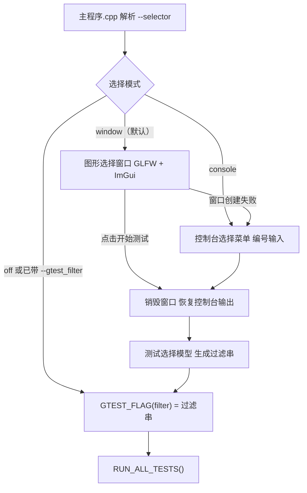

# 项目导航：测试层主调文件（测试模块选择器）

> 版次（`测试层` 子仓库）：`0555060`（选择器本体）、`272c44f`（下层重命名跟进）
> 顶层仓库：本版次无新提交
> 定位：测试层「跑哪些模块」这件事的入口在哪、怎么走、怎么改
> 配套报告：`任务报告合集/main/测试模块选择器_0555060+272c44f/执行计划.md`、`执行报告.md`

---

## 一、一句话定位

`EngineTests.exe` 不再直接进 googletest，而是先由**主调文件**决定要跑哪些模块（图形窗口树形勾选 / 控制台编号输入），确认后关闭窗口、恢复控制台输出，再用生成的过滤串执行 googletest。

---

## 二、入口与三种运行模式

| 命令 | 行为 | 代码位置 |
| --- | --- | --- |
| `EngineTests.exe`（无参） | ImGui 临时窗口树形勾选；窗口起不来自动退回控制台 | `src/主调/主程序.cpp` → `图形选择窗口.cpp` |
| `EngineTests.exe --selector=window` | 同上（显式） | 同上 |
| `EngineTests.exe --selector=console` | 控制台编号菜单，支持 `1,3-5`、`all`、空回车全跑 | `控制台选择菜单.cpp` |
| `EngineTests.exe --selector=off` | 不选择、不等待输入，全量跑（**ctest 走这条**） | 跳过选择阶段 |
| `EngineTests.exe --gtest_filter=…` | 检测到已带过滤串且未显式指定选择器 → 透传，不弹选择器 | `主程序.cpp` 参数解析 |
| `EngineTests.exe --gtest_filter=… --selector=console` | 显式选择器优先（修复过的坑，见下） | `主程序.cpp` 的「显式选择器」标志 |

---

## 三、执行流程



---

## 四、文件地图

| 文件 | 行数 | 职责 | 关键符号 |
| --- | --- | --- | --- |
| `src/主调/主程序.cpp` | 106 | 解析 `--selector`、决定是否弹选择器、设置过滤串、跑 gtest | `main`、显式选择器标志 |
| `src/主调/测试选择模型.h` / `.cpp` | 89 / 338 | 纯逻辑：反射建树、勾选状态、过滤串生成 | `测试选择模型`、`套件条目`、`全部勾选`、`全部清空`、`生成过滤串` |
| `src/主调/控制台选择菜单.h` / `.cpp` | 19 / 68 | 编号列表 + `1,3-5` / `all` 解析（最多 3 次非法重试后兜底全跑） | `控制台选择菜单_运行`、`解析控制台选择` |
| `src/主调/图形选择窗口.h` / `.cpp` | 21 / 347 | GLFW + ImGui 临时窗口：树形勾选、全选/清空/反选、主题与中文字体、按键确认 | `图形选择窗口_运行`、`应用粉色主题` |
| `src/单元测试/主调/测试选择模型测试.cpp` | 294 | 模型单元测试 **16 例**（反射一致性、勾选语义、范围解析、过滤串生成） | 套件 `测试选择模型测试` |
| `CMakeLists.txt` | — | `TestGui`（imgui 4 核 + glfw/opengl3 后端 + glad）、`TestLauncher`（模型 + 控制台菜单）、`EngineTests` 换入口、`ctest` 加 `--selector=off` | 目标 `TestGui`、`TestLauncher`、`EngineTests` |
| `external/Dear_ImGui/`、`external/glad/` | — | 第三方源码入库（沿用 `external/googletest` 惯例） | — |

---

## 五、关键约定

1. **两个视图共用同一模型**：控制台与图形窗口都只负责「勾选状态 ↔ 过滤串」，实际执行统一由主程序完成，避免两套选择逻辑分叉。
2. **过滤串生成规则**：全部勾选 → 列出每个套件的 `套件名.*`；部分勾选 → 只列所选套件。DISABLED 用例由 gtest 自行跳过。
3. **反射计数含 DISABLED**：模型统计的 303 = 279 个可跑 + 24 个 DISABLED，这点在写断言时必须记住。
4. **不动旧语义**：`--selector=off` 等价于改造前的行为，`ctest` 与既有脚本不受影响。
5. **透传与显式选择器的优先级**：`(命令行带 --gtest_filter && !显式选择器) || 选择模式 == "off"` 才跳过选择阶段——顺序写反会把 `--selector=console` 吞掉（曾踩过）。

---

## 六、怎么验证

在 `测试层/out/build/x64-Debug` 下（或先 `call vcvars64.bat`）：

```
EngineTests.exe --gtest_filter=* --gtest_brief=1          # 透传，279/279
EngineTests.exe --selector=off --gtest_brief=1            # 关选择器，279/279
echo 1-3 | EngineTests.exe --selector=console --gtest_brief=1   # 只跑所选 3 个套件
EngineTests.exe --selector=window                          # 图形窗口（需桌面环境）
ctest                                                      # 1/1 Passed
```

GUI 自动化核验脚本：`out/gui_probe.ps1`（按进程主窗口句柄抓图 + 像素统计），证据样例 `out/gui_window.png`、`out/gui_run.log`。

---

## 七、扩展点

| 想做的事 | 改哪里 |
| --- | --- |
| 加一种选择界面（如列表 + 搜索） | 新增一个视图文件，只依赖 `测试选择模型`，在主程序里加一个 `--selector` 分支 |
| 加一种选择维度（如按标签/耗时筛选） | 改 `测试选择模型`（建树与勾选语义），两个视图自动继承 |
| 改窗口外观/字体/主题 | `图形选择窗口.cpp` 的 `应用粉色主题` 与字体加载段 |
| 改过滤串格式 | 只改 `测试选择模型::生成过滤串`，视图不用动 |

---

## 八、相关记录

- 任务报告：`任务报告合集/main/测试模块选择器_0555060+272c44f/`
- 本版次跟随的引擎层改名：`Config_Checker` → `Data_Validator`（引擎层 `00a7c31` 起生效，测试层 `272c44f` 跟进）
