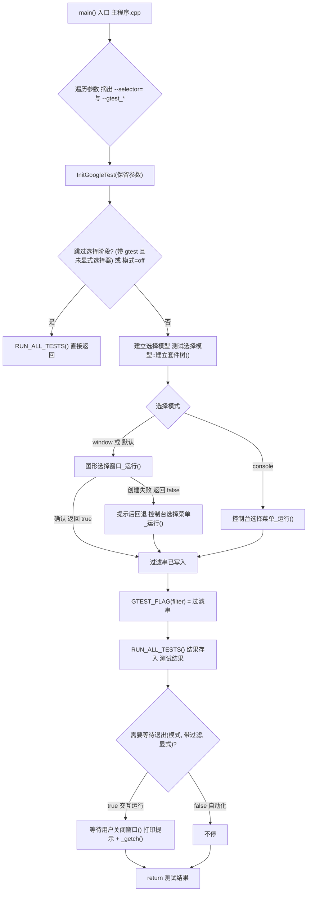

# 项目导航：测试层主调（选择器蓝色渐变 + 退出等待）

> 版次（`测试层` 子仓库）：`cf72e87`（选择窗口蓝色渐变）、`05c9994`（测试结束后停顿等待按键）、`7f0d4e7`（数据校验器空字符串用例转正）
> 提交区间：`272c44f..7f0d4e7`（分支 `test` → 远端 `sliverera/test`）
> 前序版次：`测试层` `272c44f`、`引擎层` `00a7c31`
> 顶层仓库：本版次无新提交（`main` 工作区干净）
> 定位：测试层「跑哪些模块」这件事的入口在哪、怎么走、怎么改；本版次额外聚焦两件事——**选择窗口的配色（蓝色渐变）** 与 **测试跑完要不要停住等按键**。
> 配套报告：`任务报告合集/main/选择器蓝色渐变与退出等待_cf72e87+05c9994+7f0d4e7/执行报告.md`
> 上一版导航：`项目导航合集/main/测试模块选择器_0555060+272c44f/项目导航.md`
> 本文件所有路径均为相对工作区（`白银纪元/`）的相对路径。

---

## 一、一句话定位

`EngineTests.exe` 不是直接进 googletest，而是先由**主调文件**决定要跑哪些模块：图形窗口树形勾选（默认）或控制台编号输入，确认后销毁窗口、恢复控制台输出，再用生成的过滤串执行 googletest；**测试跑完后，交互运行会停住等用户按键，自动化调用则立即返回**。

本版次相对上一版，主调侧有两处行为级变化：

1. 选择窗口的外观由「紫粉纯色」改成「深蓝 → 中蓝 → 亮蓝」两段拼接的**垂直渐变**，其余控件色板整体转蓝；
2. 新增**退出等待判定**：跑完测试后，交互路径停下来等按键（避免控制台窗口一闪而过看不到结果），自动化路径（`--selector=off`、`--gtest_filter` 透传、ctest）跑完即走，不被挂住。

配色与等待都是「只影响观感/交互节奏、不动过滤串与执行语义」的改动，回退成本低；本层没有任何第三方依赖被更新。

---

## 二、项目与层级结构

### 2.1 四层关系

`白银纪元` 工作区由四个**各自独立的 git 仓库**组成，自上而下为：

| 层 | 目录（工作区相对） | 角色 | 对外产物 |
| --- | --- | --- | --- |
| 游戏层 | `游戏层/` | 游戏逻辑与玩法，最上层消费者 | 可执行/资源 |
| 系统层 | `系统层/` | 面向引擎的系统中台（配置编辑器等） | 静态库 `SystemCore.lib` |
| 引擎层 | `引擎层/` | 引擎内核（对象、事件、四叉树、工具库等） | 静态库 `EngineCore.lib` |
| 测试层 | `测试层/` | 各层的测试产地与唯一测试入口 | 可执行 `EngineTests.exe`、库 `TestCore` / `TestLauncher` / `TestGui` |

本文件讲的是**测试层**的主调（`测试层/src/主调/`），也就是测试层的启动与选择入口。

### 2.2 层间链接方式（本层视角）

测试层遵守统一的**层级契约**：**层与层之间一律链接「已经构建好的」静态库，不拉入下层源码，也没有源码回退路径**。

- 接入函数：`测试层/cmake/接入下层.cmake` 中的 `byjy_jieru_xiaceng()`，在系统层 / 测试层 / 游戏层中**逐字节相同**。
- 本层接入 `引擎层` 与 `系统层` 两层的对外接口（`引擎层/cmake/对外接口.cmake`、`系统层/cmake/对外接口.cmake`）。
- 库定位顺序：① 覆盖变量非空则用之（文件不存在即报错）→ ② 留空则自动探测 `<下层>/out/build/*/lib/<库名>.lib`，取时间戳最新的一份 → ③ 都没有则 `FATAL_ERROR` 并提示先构建下层。
- 注意：**系统层的对外面已并入引擎层的对外面**，所以引擎层到达的包含目录（`common/` 预编译头、`src/` 头文件、`external/Json`、`external/glfw` 等）在本层一并到位。图形选择窗口用到的 GLFW 头与 `glfw3.lib` 正是从这条链路传来的。

### 2.3 本层产物与目标（`测试层/CMakeLists.txt`）

| 目标 | 类型 | 来源 | 说明 |
| --- | --- | --- | --- |
| `TestCore` | 静态库 | `测试层/src/**`（排除 `单元测试/`、`主调/`） | 功能测试器集合，当前基本为空 |
| `TestGui` | 静态库 | `external/Dear_ImGui`（4 个核心 cpp + 2 个后端）+ `external/glad` | 供图形选择窗口使用；不编 `imgui_demo.cpp` |
| `TestLauncher` | 静态库 | `测试层/src/主调/测试选择模型.cpp` + `控制台选择菜单.cpp` | 只收纯逻辑，图形窗口不进此库，避免用例拖上图形库 |
| `EngineTestObjects` | OBJECT 库 | `测试层/src/单元测试/**.cpp` | 用例必须以 OBJECT 收集，不能进静态库（见「坑」） |
| `EngineTests` | 可执行 | `EngineTestObjects` + `主程序.cpp` + `图形选择窗口.cpp` | **本层唯一可执行文件**，`main` 由主调提供；产物落在 `测试层/` 根目录 |

宿主机制（引擎宿主 / 系统宿主 / 全栈宿主）已取消，可执行文件只在测试层产生；`EngineTests.exe` 既是单元测试入口也是启动项。

### 2.4 用例目录布局

`测试层/src/单元测试/` 按被测对象分三棵子树：

| 子树 | 内容 | 当前文件数 |
| --- | --- | --- |
| `核心/` | 引擎内核（对象、对象池、碰撞、事件、四叉树等） | 8 个用例文件 |
| `工具/` | 引擎工具（数据校验器、路径转换、计时器、日志、网格加载器等） | 9 个用例文件 |
| `主调/` | 本层主调（选择模型、退出暂停判定） | 2 个用例文件 |

本版次的规模变化只发生在 `工具/数据校验器测试.cpp`（转正 1 例）与新增的 `主调/退出暂停判定测试.cpp`（+8 例）。

---

## 三、入口与运行模式

### 3.1 分流表

`main()` 位于 `测试层/src/主调/主程序.cpp`。第一步先摘出**自定义开关** `--selector=`，其余参数原样保留给 googletest；第二步把保留参数交给 `::testing::InitGoogleTest()`；第三步才根据「是否显式选择器」「是否带 gtest 参数」「选择模式」决定走哪条路。

| 命令行 | 行为 | 是否弹选择器 | 测试后是否停住等待 | 代码位置 |
| --- | --- | --- | --- | --- |
| `EngineTests.exe`（无参） | 图形窗口树形勾选；窗口起不来到控制台菜单 | 是（默认 `window`） | 是 | `主程序.cpp` → `图形选择窗口.cpp` |
| `EngineTests.exe --selector=window` | 同上（显式） | 是 | 是 | 同上 |
| `EngineTests.exe --selector=console` | 控制台编号菜单，支持 `1,3-5` / `all` / 空回车全跑 | 是 | 是 | `控制台选择菜单.cpp` |
| `EngineTests.exe --selector=off` | 不选择、不等待输入，全量跑（**ctest 走这条**） | 否 | 否 | 跳过选择阶段 |
| `EngineTests.exe --gtest_filter=…` | 检测到 `--gtest_*` 且未显式指定选择器 → 透传，不弹选择器 | 否 | 否 | `主程序.cpp` 参数解析 |
| `EngineTests.exe --gtest_filter=… --selector=console` | 显式选择器优先，仍弹控制台菜单 | 是 | 是 | `主程序.cpp` 的「显式选择器」标志 |

### 3.2 透传规则的优先级（本层最容易写错的判定）

程序在参数遍历时维护两个布尔量：

- `显式选择器`：命令行出现过 `--selector=`（`主程序.cpp` 第 76、89 行）。
- `命令行带过滤`：命令行出现过 `--gtest_` 前缀参数（第 79、94~95 行）。

「跳过选择阶段」的判定（第 112 行）与「退出是否等待」的判定（第 142 行）**用的是同一套口径**：

```
(命令行带过滤 && !显式选择器) || 选择模式 == "off"
```

- 左支：带 `--gtest_*` 但**没有**显式选择器 → 视为自动化调用，透传。
- 右支：显式 `--selector=off` → 不开窗直接全跑。
- 顺序不能写反：若先判 `命令行带过滤` 而忽略 `显式选择器`，`--gtest_filter=… --selector=console` 会被错误地透传，把用户显式指定的控制台菜单吞掉（这是曾经踩过的坑，见「坑」一节）。

### 3.3 过滤串如何生成

选择阶段只产出**一个 `--gtest_filter` 过滤串**，两个视图（图形窗口 / 控制台菜单）都只是「勾选状态 ↔ 过滤串」的翻译层，真正的执行统一在主程序：`::testing::GTEST_FLAG(filter) = 过滤串;`（第 138 行）。

过滤串的生成规则集中在 `测试选择模型::生成过滤串()`（`测试选择模型.cpp` 第 214~259 行）：

- **全不选** → 返回 `"*"`（与 gtest 的「全跑」语义一致）；
- **整套件全选** → 压缩成 `套件名.*`；
- **部分勾选** → 逐条列成 `套件名.用例名`；
- 多个片段之间用 `:` 连接。

图形窗口另有两条兜底：按 `Esc` 或点「取消（全跑）」→ 过滤串写 `"*"`；直接关窗口（未点按钮）→ 同样写 `"*"`（`图形选择窗口.cpp` 第 378~379 行）。

---

## 四、执行流程



配色只影响流程中的 `H`（图形窗口）那一格，不改变任何判定与分支。

---

## 五、文件地图

以下行数为本版次实测（工作区相对路径）。「关键符号」列出该文件里最值得先看的名字。

### 5.1 主调（`测试层/src/主调/`）

| 文件 | 行数 | 职责 | 关键符号 |
| --- | --- | --- | --- |
| `测试层/src/主调/主程序.cpp` | 146 | `main()` 入口：摘 `--selector=`、重建 argv、透传/关闭分支、建模型、取过滤串、跑 gtest、按需等待 | `main`、匿名命名空间 `选择器前缀` / `等待用户关闭窗口()`、`engine::需要等待退出()`、`显式选择器`、`命令行带过滤` |
| `测试层/src/主调/退出等待判定.h` | 23（新增） | 只放一条声明：`需要等待退出` 的契约与两种返回 false 的情形说明 | `engine::需要等待退出` |
| `测试层/src/主调/图形选择窗口.h` | 22 | 图形窗口入口声明 | `engine::图形选择窗口_运行` |
| `测试层/src/主调/图形选择窗口.cpp` | 383 | GLFW + OpenGL3 + Dear ImGui 临时勾选窗口：中文字体、蓝色渐变背景、蓝色主题、树形勾选、搜索、确认/取消 | `窗口宽度/高度`、`收集候选字体路径()`、`加载中文字体()`、`渐变顶端色/中段色/底端色`、`应用蓝色主题()`、`绘制蓝色渐变背景()`、`含关键词()`、`图形选择窗口_运行()` |
| `测试层/src/主调/测试选择模型.h` | 90 | 纯逻辑模型：`用例条目` / `套件条目` / `测试选择模型` 类 + `解析控制台选择` 声明 | `测试选择模型`、`建立套件树`、`生成过滤串`、`套件全选` / `套件半选`、`解析控制台选择` |
| `测试层/src/主调/测试选择模型.cpp` | 339 | 模型实现：反射建树、勾选态维护、过滤串生成、控制台输入解析 | 匿名 `数字解析()`、`测试选择模型::建立套件树`、`测试选择模型::生成过滤串`、`engine::解析控制台选择` |
| `测试层/src/主调/控制台选择菜单.h` | 20 | 控制台菜单入口声明 | `engine::控制台选择菜单_运行` |
| `测试层/src/主调/控制台选择菜单.cpp` | 69 | 打印编号列表、读 `all` / `1,3-5`、最多 3 次非法重试后兜底全跑 | `控制台选择菜单_运行` |

### 5.2 用例（`测试层/src/单元测试/`）

| 文件 | 行数 | 用例数 | 覆盖点 |
| --- | --- | --- | --- |
| `测试层/src/单元测试/主调/测试选择模型测试.cpp` | 295 | 16 | 反射建树一致性、默认全选、半选态、批量勾选、展开态读写、过滤串四种分支、控制台解析（全选/区间/非法/越界） |
| `测试层/src/单元测试/主调/退出暂停判定测试.cpp` | 64（新增） | 8 | `需要等待退出` 的全部分支组合（见第七节真值表） |
| `测试层/src/单元测试/工具/数据校验器测试.cpp` | 206 | 20（含 1 个 DISABLED） | 字段存在性、整数/浮点/字符串/容器/嵌套对象类型校验、路径有效性检查；本版次「空字符串字段被拒绝」由禁用转正 |

其余用例（`核心/` 8 个、`工具/` 另外 8 个）本版次未改动，行数从略。

### 5.3 构建脚本

| 文件 | 行数 | 要点 |
| --- | --- | --- |
| `测试层/CMakeLists.txt` | 300 | 接入下层（引擎层/系统层）→ 源文件收集与过滤 → `TestCore` → `TestGui`（3.5 节）→ 接入 googletest（第 4 节）→ `TestLauncher`（4.5 节）→ `EngineTestObjects`（OBJECT）→ `EngineTests`（第 5 节）→ ctest 注册 |

本版次**未改动 `CMakeLists.txt`**：新增的 `退出等待判定.h`、`退出暂停判定测试.cpp` 由既有的 `file(GLOB_RECURSE ... CONFIGURE_DEPENDS)` 收集规则自动纳入，`退出等待判定.h` 是纯头文件不产生编译单元，`主程序.cpp` 提供实现并链接进 `EngineTests`。

### 5.4 第三方（沿用既有入库惯例）

| 目录 | 说明 |
| --- | --- |
| `测试层/external/Dear_ImGui/` | Dear ImGui 源码副本（编 `imgui` / `imgui_draw` / `imgui_tables` / `imgui_widgets` + glfw/opengl3 后端） |
| `测试层/external/glad/` | OpenGL 函数加载器 |
| `测试层/external/googletest/` | googletest 源码内嵌（`EXCLUDE_FROM_ALL` 接入，只在被依赖时编译） |

---

## 六、本次新增（一）：选择窗口配色约定

配色改动只发生在 `测试层/src/主调/图形选择窗口.cpp`，提交为 `cf72e87`（1 file changed / +60 −25）。**只改颜色与背景绘制，不动任何勾选/过滤串逻辑**。

### 6.1 渐变三段色（文件级常量）

定义在 `图形选择窗口.cpp` 第 92~95 行，位于匿名命名空间内：

| 常量 | RGBA（ImVec4） | 角色 |
| --- | --- | --- |
| `渐变顶端色` | `(0.05, 0.11, 0.26, 1.00)` | 深蓝，视口**顶部** |
| `渐变中段色` | `(0.12, 0.28, 0.55, 1.00)` | 中蓝，视口**正中**（两段的分界） |
| `渐变底端色` | `(0.26, 0.52, 0.85, 1.00)` | 亮蓝，视口**底部** |

这三个常量由两处共用，**不要只改其中一处**：

1. `绘制蓝色渐变背景()`（第 136~159 行）——真正画出渐变；
2. `glClearColor(渐变顶端色.x, 渐变顶端色.y, 渐变顶端色.z, 1.00f)`（第 360 行）——兜底清屏色，取「顶端色」的 RGB。旧版这里写死的是 `glClearColor(0.30, 0.16, 0.34, 1)`（紫粉），本版次改为引用常量。

### 6.2 渐变是怎么画出来的

ImGui 没有原生的「多段线性渐变」原语，所以用**两段矩形拼接**实现三段色，落在**背景绘制列表**上（在所有窗口之后）：

```
上半段：矩形(左上 → 视口中点)  顶角=顶端色  底角=中段色
下半段：矩形(视口中点 → 视口底) 顶角=中段色  底角=底端色
```

实现要点（`绘制蓝色渐变背景()`）：

- `ImGui::GetMainViewport()` 取主视口，`左上 = 视口->Pos`、`宽度 = 视口->Size.x`、`中点 = 视口->Size.y * 0.5f`；
- 用 `ImGui::GetColorU32(常量)` 把 `ImVec4` 转成 `ImU32`；
- `ImGui::GetBackgroundDrawList()` 拿到背景绘制列表，连续两次 `AddRectFilledMultiColor(...)` 拼接；
- 调用时机：主循环里 `ImGui::NewFrame()` **之后**、`ImGui::Begin("##测试选择", ...)` **之前**（第 232 行），保证渐变在最底层。

### 6.3 `WindowBg` 必须透明（最容易出错的一点）

`应用蓝色主题()`（第 98~133 行）里，窗口底色被显式写成 alpha = 0：

```cpp
颜色[ImGuiCol_WindowBg] = ImVec4(0.10f, 0.22f, 0.44f, 0.00f);  // 最后一个分量 0.00
```

**原因**：渐变画在「背景绘制列表」里，而窗口（`##测试选择` 是铺满视口的无标题面板）会盖在背景绘制列表之上。若 `WindowBg` 的 alpha 不为 0，窗口自身的不透明底色会把渐变整块遮住，看起来仍像纯色。这是本次唯一「不显式改颜色就会出错」的地方。

其余控件色板同步转蓝（同一函数内），保持层次可读：

| `ImGuiCol_*` | 值（RGBA） |
| --- | --- |
| `ChildBg` | `(0.08, 0.18, 0.38, 0.55)`（半透明，让渐变仍能透一点） |
| `PopupBg` | `(0.12, 0.25, 0.50, 0.98)` |
| `Border` | `(0.55, 0.78, 1.00, 0.55)` |
| `Text` / `TextDisabled` | `(0.96, 0.98, 1.00, 1.00)` / `(0.72, 0.82, 0.95, 1.00)` |
| `FrameBg` / `FrameBgHovered` / `FrameBgActive` | `(0.16,0.33,0.62,1)` / `(0.22,0.44,0.76,1)` / `(0.28,0.52,0.84,1)` |
| `Button` / `ButtonHovered` / `ButtonActive` | `(0.20,0.44,0.80,1)` / `(0.32,0.60,0.94,1)` / `(0.15,0.35,0.68,1)` |
| `Header` / `HeaderHovered` / `HeaderActive` | `(0.24,0.48,0.82,0.95)` / `(0.34,0.60,0.92,1)` / `(0.20,0.42,0.74,1)` |
| `CheckMark` | `(0.62, 0.86, 1.00, 1.00)` |
| `SliderGrab` | `(0.40, 0.68, 0.96, 1.00)` |
| `ScrollbarBg` / `ScrollbarGrab` | `(0.08,0.18,0.38,0.80)` / `(0.28,0.54,0.86,1)` |
| `TitleBg` / `TitleBgActive` | `(0.16,0.36,0.68,1)` / `(0.24,0.48,0.82,1)` |

柔和圆角与内边距（同函数末尾，本版次未改）：`WindowRounding 8.0`、`FrameRounding 5.0`、`GrabRounding 5.0`、`WindowPadding (12,12)`、`FramePadding (8,5)`、`ItemSpacing (8,6)`。

### 6.4 想改配色要动哪几处（清单）

1. `测试层/src/主调/图形选择窗口.cpp` 第 92~95 行的三个渐变常量（含 alpha 均为 1.00）；
2. 第 98~133 行 `应用蓝色主题()` 里各 `ImGuiCol_*`（尤其 `WindowBg` 的 alpha 必须保持 0.00）；
3. 若背景不是纯渐变而是想换底色，第 360 行 `glClearColor(...)` 会自动跟随「顶端色」——保持其引用常量即可。
4. 函数名、注释里的「蓝色」字样（`应用蓝色主题` / `绘制蓝色渐变背景`）也一并改名，便于下次检索；旧的 `应用粉色主题` 已不存在，任何地方再出现它都是过时描述。

---

## 七、本次新增（二）：退出等待流程

提交 `05c9994`（3 files changed / +127 −1）：`测试层/src/主调/主程序.cpp`、新增 `测试层/src/主调/退出等待判定.h`、新增 `测试层/src/单元测试/主调/退出暂停判定测试.cpp`。

### 7.1 为什么要停住

此前 `main()` 以 `return RUN_ALL_TESTS();` 结束，交互运行时控制台窗口会随进程退出而一闪而过，用户看不到测试结果。本版次在跑完后按需停下等按键。

### 7.2 判定函数与实现

声明：`测试层/src/主调/退出等待判定.h`

```cpp
namespace engine {
    bool 需要等待退出(const std::string& 选择模式, bool 命令行带过滤, bool 显式选择器);
}
```

实现：`测试层/src/主调/主程序.cpp` 第 52~64 行，逻辑极简——**先看是否自动化透传，再看是否显式关闭选择器，其余一律等待**：

```cpp
if (命令行带过滤 && !显式选择器) return false;  // 自动化透传
if (选择模式 == "off")            return false;  // ctest 形态
return true;                                     // 交互运行
```

`main()` 末尾（第 139~144 行）：

```cpp
const int 测试结果 = RUN_ALL_TESTS();
if (engine::需要等待退出(选择模式, 命令行带过滤, 显式选择器))
    等待用户关闭窗口();
return 测试结果;   // 原样返回，退出码不受等待影响
```

### 7.3 判定真值表

| 选择模式 | 命令行带过滤 | 显式选择器 | `需要等待退出` | 场景 |
| --- | --- | --- | --- | --- |
| `window` | 否 | 否 | **true** | 无参默认运行 |
| `window` | 否 | 是 | **true** | `--selector=window` |
| `console` | 否 | 是 | **true** | `--selector=console` |
| `off` | 否 | 否 | **false** | 直接关闭选择器 |
| `off` | 否 | 是 | **false** | `--selector=off` |
| `window` | 是 | 否 | **false** | `--gtest_filter=…`（透传） |
| `console` | 是 | 否 | **false** | `--gtest_*` 透传 |
| `off` | 是 | 否 | **false** | 透传 + 关闭 |
| `window` | 是 | 是 | **true** | 显式选择器**优先**于透传 |
| `console` | 是 | 是 | **true** | 同上 |
| `off` | 是 | 是 | **false** | 显式关闭 |
| 任意未知串 | 否 | 是 | **true** | 未知模式按交互兜底（宁可多等一次，也不要一闪而过） |

两个返回 false 的分支合起来正是「主程序跳过选择阶段」的同一条件（第 112 行），两处口径必须一致——否则会出现「弹了窗却不停」或「没弹窗却停住」的错配。

### 7.4 等待动作本身

`等待用户关闭窗口()` 是 `主程序.cpp` 匿名命名空间里的文件内部函数（第 36~47 行）：

1. `::GetConsoleWindow() == nullptr` → **直接返回**（重定向 / CI / 无控制台窗口的场景无处可等，跳过以免挂住）；
2. 打印 `[测试选择] 测试已结束，按任意键关闭窗口…`；
3. `::FlushConsoleInputBuffer(::GetStdHandle(STD_INPUT_HANDLE))` 清掉选择阶段残留的按键，避免「确认」用的回车被这里立刻吃掉；
4. `::_getch()` 阻塞等一个按键。

### 7.5 无控制台环境的行为

当进程被重定向（stdout 直连管道、`start /min cmd /c ...` 之外的形态）时，`GetConsoleWindow()` 返回空，等待被跳过，进程自行退出。**这是预期设计而非缺陷**——它正是「自动化调用不被挂住」的保障。因此：

- GUI 窗口/控制台菜单的交互验证，必须在**真控制台**里跑（用 `start ... cmd /c` 另开窗口），否则看不到等待提示；
- 自动化脚本（ctest、CI）走 `--selector=off` 或透传，本就不会进入等待分支。

### 7.6 为什么把判定抽成纯函数

等待动作是阻塞式控制台交互，**无法自动化**（`_getch()` 会挂住测试进程）。把「要不要等」抽成不含副作用的纯函数 `engine::需要等待退出(...)` 后，可以用 8 个用例覆盖全部分支组合；剩下只剩 `_getch()` 那一行靠真实运行验证。为让「用例验证的判定」与「主程序实际使用的判定」是**同一份逻辑**，头文件只放声明、实现放在 `主程序.cpp`，用例直接链接可执行文件的同名符号（`单元测试/主调/退出暂停判定测试.cpp` 里 `#include "src/主调/退出等待判定.h"`）。

---

## 八、关键约定与踩过的坑

### 8.1 约定

1. **两个视图共用同一模型**：控制台菜单与图形窗口都只负责「勾选状态 ↔ 过滤串」，实际执行统一由 `主程序.cpp` 完成，避免两套选择逻辑分叉。新增视图时也应只依赖 `测试选择模型`。
2. **过滤串生成规则**（`测试选择模型::生成过滤串()`）：全不选 → `"*"`；整套件全选 → `套件名.*`；部分勾选 → 逐条 `套件名.用例名`，用 `:` 连接。
3. **反射计数含 DISABLED**：模型统计的用例总数把 DISABLED 用例也算进去。本版次注册用例总数为 **310 = 287 可跑 + 23 DISABLED**（上一版为 303 = 279 + 24）。gtest 自己会跳过 DISABLED，但**模型/选择树里它们照样出现**，写断言时要记住这点，且以实测数为准。
4. **不动旧语义**：`--selector=off` 等价于改造前的行为，`ctest` 与既有脚本不受影响；本版次新增的等待逻辑对自动化路径（透传、`off`）一律不生效。
5. **判定口径必须唯一**：「跳过选择阶段」与「跑完是否等待」用的是同一个布尔式 `(命令行带过滤 && !显式选择器) || 选择模式 == "off"`。两处若分叉，就会出现「弹了窗却不停」或「没弹窗却停住」。
6. **配色三常量 + `WindowBg` alpha=0 是一套**：改渐变颜色必须同步改 `glClearColor` 的引用；改主题色板必须保证 `WindowBg` 的 alpha 仍是 0.00。
7. **等待动作只在真控制台生效**：`GetConsoleWindow()` 为空即跳过，这是设计而非缺陷。

### 8.2 踩过的坑（含历史沉淀）

| 坑 | 现象 | 正确做法 |
| --- | --- | --- |
| 透传判定顺序写反 | `--gtest_filter=… --selector=console` 被当成透传，显式指定的控制台菜单被吞 | 顺序写成 `(命令行带过滤 && !显式选择器) || 模式=="off"`，**先判断是否显式指定选择器** |
| 窗口底色盖住渐变 | `WindowBg` 不透明时背景绘制列表里的渐变整块被盖住，看着仍是纯色 | `ImGuiCol_WindowBg` 的 alpha 必须为 0.00，让渐变透出 |
| `glClearColor` 忘同步 | 只改渐变常量、忘了清屏色，会出现「渐变之外一圈旧色」 | `glClearColor(...)` 引用 `渐变顶端色` 的 xyz，随常量走 |
| 用例并入静态库 | 用例静默不跑 | 用例必须用 **OBJECT 库** `EngineTestObjects` 收集（静态库里未被引用的 `.obj` 连同 `TEST` 宏的静态注册一起被链接器丢弃） |
| 中文路径与 ctest 逐用例注册 | `gtest_discover_tests` 写 JSON 报告按 ANSI 解析路径，中文路径必失败，构建被判失败 | 工程路径纯 ASCII 才逐用例注册；否则退化为整体注册 `add_test(NAME EngineTests COMMAND EngineTests --selector=off)`（本机路径含中文，走的是后者） |
| `cmake` / `ctest` 不在 PATH | 命令直接找不到 | 从 `CMakeCache.txt` 的 `CMAKE_COMMAND` / `CMAKE_CTEST_COMMAND` 取绝对路径（VS 附带 CMake，生成器 Ninja），构建前先 `call vcvars64.bat` |
| `EngineTests.exe` 找不到 | 在构建目录里跑报 `TEST_FAIL` | 产物落在 `测试层/` **根目录**（`RUNTIME_OUTPUT_DIRECTORY` 就是本层根），不是 `out/build/...` 下 |
| cmd 直接传中文路径被吞 | `git add` 中文路径失败 | 提交信息用 `git commit -F <UTF-8 文件>`，路径用 `git add --pathspec-from-file=<UTF-8 文件>` |
| 交互进程残留 | 等待分支会让交互进程停住不退出，多次验证后堆了多个 `EngineTests.exe` | 验证后 `taskkill` 清理；无控制台（重定向）时等待自动跳过，属预期 |
| 鼠标交互无法自动化 | agent 不能勾选/点按钮 | 交互验收走控制台路径（键盘/管道输入）；GUI 鼠标验收由用户在真机完成 |
| 现状固化用例会反成负担 | 依赖旧行为的「现状固化」用例在缺陷修复后必失败 | 缺陷修复后把 `DISABLED_` 用例转正，同时删掉对应的现状固化用例（本版次 `7f0d4e7` 就是这么处理的） |

### 8.3 本版次的遗留与注意

- **配色未经人眼二次核对**：本轮计划的「截屏 + 读图核对渐变」在收尾阶段被用户叫停，**未执行**。上一版次的窗口截图 `测试层/out/gui_window.png` 拍摄于改色之前（紫粉底色），**不能**作为本次证据；渐变数值与实现路径已逐行核对，但「肉眼看起来是不是想要的蓝」需用户双击 `EngineTests.exe` 确认。
- **引擎层存在任务之外的未提交改动**：`引擎层/src/tools/Data_Validator/...` 属用户进行中的修复，本次未触碰、未提交；测试层 `7f0d4e7`（用例转正）依赖该修复生效。
- **既有遗留未动**：引擎层 `区块信息检索.hpp` 的 C4715 告警、事件系统三处既有缺陷均未处理；`数据校验器测试.cpp` 里的 `DISABLED_布尔字段检查` 仍是已知缺陷（bool 被整数分支拦截），修复后去掉前缀即可转正。

---

## 九、怎么验证

### 9.1 环境说明

- `cmake` / `ctest` **不在 PATH**。要使用 VS 自带的 CMake，先 `call vcvars64.bat`，再从 `CMakeCache.txt` 取绝对路径（本机为 VS 附带 CMake，生成器 Ninja）。
- 构建树：`测试层/out/build/x64-Debug`。
- 可执行产物：`测试层/EngineTests.exe`（**在本层根目录，不在构建目录**）。
- 前置条件：引擎层 / 系统层的静态库须已构建（否则配置阶段 `byjy_jieru_xiaceng()` 报 `FATAL_ERROR`）。

### 9.2 可复制命令（在 `测试层/` 根目录下执行）

```
:: 配置（首次）
cmake -S . -B out/build/x64-Debug -G Ninja
:: 构建
cmake --build out/build/x64-Debug

:: 全量用例（自动化路径，不停住）
EngineTests.exe --selector=off --gtest_brief=1                    :: 287/287 通过

:: 透传（自动化路径，不停住）
EngineTests.exe --gtest_filter=* --gtest_brief=1                  :: 287/287

:: 控制台菜单（交互路径，跑完停住等按键）
echo 1-3 | EngineTests.exe --selector=console --gtest_brief=1     :: 只跑所选套件

:: 图形窗口（需桌面环境；跑完同样停住等按键）
EngineTests.exe --selector=window

:: 只跑本版次新增的判定用例
EngineTests.exe --gtest_filter=退出暂停判定测试.* --gtest_brief=1 :: 8/8

:: ctest（整体注册一个用例，走 --selector=off）
ctest --output-on-failure                                         :: 1/1 Passed
```

### 9.3 等待行为的验证技巧

- **要看到「停住等待」**，必须在真控制台里跑交互路径，例如：
  `start /min cmd /c "echo 1 | EngineTests.exe --selector=console --gtest_brief=1"`，稍后查 `tasklist | findstr EngineTests`，进程应**仍存活**，日志尾部为 `[测试选择] 测试已结束，按任意键关闭窗口…`。
- **要验证「不挂住」**，把同一命令的 stdout 直接重定向到管道（不加 `start`），进程应自行退出且**无**等待提示行——因为 `GetConsoleWindow()` 为空，等待被跳过。
- 每次交互验证后记得 `taskkill /IM EngineTests.exe` 清理残留进程。

### 9.4 GUI 自动化核验脚本（沿用上一版次）

`测试层/out/gui_probe.ps1`：按进程主窗口句柄抓图 + 像素统计；证据样例 `测试层/out/gui_window.png`、`测试层/out/gui_run.log`。注意上一版次的 `gui_window.png` 是紫粉底色的旧图，改色后需重新采集才有意义（本版次未重新采集）。

### 9.5 本版次实测结果（摘自执行报告）

| 项目 | 命令 | 结果 |
| --- | --- | --- |
| 构建 | `cmake --build 测试层/out/build/x64-Debug` | 成功（exit 0） |
| 全量用例 | `EngineTests.exe --selector=off --gtest_brief=1` | **287 / 287 通过**，21 套件，23 DISABLED，exit=0 |
| ctest | `ctest --output-on-failure` | **1/1 Passed**，0.18 sec |
| 交互路径停住 | `start /min cmd /c "echo 1 \| EngineTests.exe --selector=console ..."` | 进程仍存活，尾部为等待提示 → 等待生效 ✓ |
| 无控制台不挂 | 同上但 stdout 直连管道 | 无等待提示行，进程自行退出 → 跳过等待 ✓ |

规模对比：**279 用例 / 20 套件 → 287 用例 / 21 套件**（+8 例、+1 套件），**DISABLED 24 → 23**（转正 1 例）。净增的 8 例全部来自新增的 `退出暂停判定测试`；`数据校验器测试` 一增一删净变化为 0，只体现在 DISABLED 计数上。

---

## 十、扩展点

| 想做的事 | 改哪里 |
| --- | --- |
| **改窗口配色 / 渐变** | `测试层/src/主调/图形选择窗口.cpp` 第 92~95 行三个渐变常量 + `应用蓝色主题()` 的色板（保证 `WindowBg` alpha=0）+ 第 360 行 `glClearColor` 的引用 |
| **给窗口加新控件** | 同文件主循环（第 223~368 行）：工具条在 `ImGui::Separator()` 前，选择树在 `BeginChild("##选择树")` 内，底部按钮在 `EndChild()` 之后 |
| **加一种选择界面（如列表 + 搜索）** | 新增一个视图文件，只依赖 `测试选择模型`，在 `主程序.cpp` 里加一个 `--selector` 分支；同步在「跳过选择阶段」与「需要等待退出」两处判定里考虑该模式 |
| **加一种选择维度（如按标签/耗时筛选）** | 改 `测试选择模型`（建树与勾选语义），两个视图自动继承；必要时扩展 `生成过滤串` |
| **改过滤串格式** | 只改 `测试选择模型::生成过滤串`（`测试选择模型.cpp` 第 214~259 行），视图不用动 |
| **改控制台输入格式** | 只改 `engine::解析控制台选择`（第 264~337 行）；错误重试上限在 `控制台选择菜单.cpp` 第 26 行的 `for (int 尝试 = 0; 尝试 < 3; ++尝试)` |
| **改「跑完是否停住」的规则** | 只改 `engine::需要等待退出`（声明在 `退出等待判定.h`，实现在 `主程序.cpp` 第 52~64 行），并同步更新 `退出暂停判定测试.cpp` 的真值表用例 |
| **把等待动作做得更友好** | `主程序.cpp` 匿名命名空间的 `等待用户关闭窗口()`（第 36~47 行）——提示语、清输入缓冲、按键读取都在这里 |
| **改中文字体回退顺序** | `图形选择窗口.cpp` 的 `收集候选字体路径()`（第 32~58 行）与 `加载中文字体()`（第 61~90 行） |

---

## 十一、相关记录

- 本版次任务报告：`任务报告合集/main/选择器蓝色渐变与退出等待_cf72e87+05c9994+7f0d4e7/执行报告.md`
- 上一版导航（本文件的底稿）：`项目导航合集/main/测试模块选择器_0555060+272c44f/项目导航.md`
- 上一版次前序：测试层 `272c44f`（下层重命名跟进：`Config_Checker` → `Data_Validator`，随引擎层 `00a7c31` 生效）
- 本层远端：`测试层` 分支 `test` → `sliverera/test`（`https://github.com/yuxingyuzhong/SilverEra.git`），本版次推送区间 `272c44f..7f0d4e7`

---

## 十二、本版次相对上一版的变化

> 上一版为 `测试模块选择器_0555060+272c44f`，本版为 `选择器蓝色渐变与退出等待_cf72e87+05c9994+7f0d4e7`。以下逐条列出增、改、删。

### 12.1 新增

1. **退出等待判定（源码）**：新增 `测试层/src/主调/退出等待判定.h`（声明）+ `主程序.cpp` 中 `engine::需要等待退出(...)` 实现（第 52~64 行）；返回 false 的两种情形为「带 `--gtest_*` 且未显式指定选择器」与「选择模式 == `off`」。
2. **等待动作（源码）**：`主程序.cpp` 匿名命名空间新增 `等待用户关闭窗口()`（第 36~47 行）：`GetConsoleWindow()` 判空 → 打印提示 → `FlushConsoleInputBuffer` → `_getch()`。
3. **判定用例**：新增 `测试层/src/单元测试/主调/退出暂停判定测试.cpp`（64 行，**8 例**），覆盖判定函数全部分支组合 → 测试规模 +8 例 / +1 套件。
4. **渐变常量**：`图形选择窗口.cpp` 新增 `渐变顶端色` / `渐变中段色` / `渐变底端色` 三个文件级常量。
5. **渐变绘制**：同文件新增 `绘制蓝色渐变背景()`（第 136~159 行），用背景绘制列表 + 两段 `AddRectFilledMultiColor` 实现三段色。
6. **文档新增面**：本导航新增「配色约定」「退出等待流程（含判定真值表）」两个专题章节，以及「本版次相对上一版的变化」一节。

### 12.2 修改

1. **配色转蓝 + 渐变**：`应用粉色主题()` → `应用蓝色主题()`（`图形选择窗口.cpp` 第 98~133 行），全部 `ImGuiCol_*` 换蓝系；`WindowBg` 由紫粉不透明改为 `(0.10, 0.22, 0.44, 0.00)`（alpha 归零）。
2. **清屏色跟随常量**：`glClearColor(0.30, 0.16, 0.34, 1)` → `glClearColor(渐变顶端色.x, .y, .z, 1)`（第 360 行）。
3. **渲染循环插入渐变**：`NewFrame()` 之后、画铺满视口的无标题面板之前，调用 `绘制蓝色渐变背景()`（第 232 行）。
4. **`main()` 结束方式**：`return RUN_ALL_TESTS();` → 先取返回值 `测试结果`，按需 `等待用户关闭窗口()`，再 `return 测试结果;`（**退出码不变**，ctest 判定的仍是测试结果）。
5. **数据校验器用例转正**：`工具/数据校验器测试.cpp` 中 `DISABLED_空字符串字段被拒绝` → `空字符串字段被拒绝`（去掉禁用前缀，转为正式回归用例），注释同步改写。
6. **文档口径更新（数字）**：上一版写「反射计数含 DISABLED：303 = 279 可跑 + 24 DISABLED」，本版更新为 **310 = 287 可跑 + 23 DISABLED**（287 通过 / 21 套件 / 23 DISABLED 为实测值）。模型里的「用例总数」含 DISABLED，写断言时以实测数为准，不要照搬旧数字。
7. **文档口径更新（配色）**：上一版「改窗口外观/字体/主题 → 改 `应用粉色主题`」已过时，本版改为指向三个渐变常量 + `应用蓝色主题`，并强调 `WindowBg` alpha 必须为 0。

### 12.3 删除

1. **旧配色函数名**：`应用粉色主题()` 已不存在（改名并换色），任何文档/代码里再出现 `应用粉色主题` 都是过时描述。
2. **紫粉清屏常量**：`glClearColor(0.30, 0.16, 0.34, 1)` 被替换，不再作为魔法数字存在。
3. **现状固化用例**：删除了 `数据校验器测试.cpp` 中依赖「空字符串被放行」旧行为的现状固化用例（留着重跑必失败）。

### 12.4 未变（继承上一版）

- 主调的三种运行模式、透传规则与优先级、过滤串生成规则、控制台菜单的输入格式与重试策略、图形窗口的树形勾选/搜索/全选清空反选、中文字体回退顺序、构建脚本与层级契约、第三方入库方式，均**保持不变**。
- `测试选择模型测试.cpp`（16 例）本版次未改动。

---

## 附：一屏速查

| 问题 | 一句话答案 |
| --- | --- |
| 入口在哪 | `测试层/src/主调/主程序.cpp` 的 `main()` |
| 默认跑什么 | 弹 ImGui 窗口勾选；`Esc`/关窗 = 全跑；`--selector=off` = 不开窗全跑 |
| 怎么只跑几个套件 | `echo 1,3-5 \| EngineTests.exe --selector=console` |
| 跑完为什么停住 | 交互路径会等按键（`需要等待退出` 为真）；自动化路径不停 |
| 为什么自动化不停住 | 透传或 `--selector=off` 时判定为 false；无控制台时等待也会自动跳过 |
| 窗口蓝色从哪来 | `图形选择窗口.cpp` 三个渐变常量 + `绘制蓝色渐变背景()`；`WindowBg` alpha=0 让它透出 |
| 改配色要动几处 | 三常量 + `应用蓝色主题()` 色板 + `glClearColor` 引用 |
| 当前规模 | **287 用例通过 / 21 套件 / 23 DISABLED**（注册总数 310） |
| 用例为什么用 OBJECT 库 | 否则 `TEST` 宏的静态注册会被链接器丢弃，用例静默不跑 |
